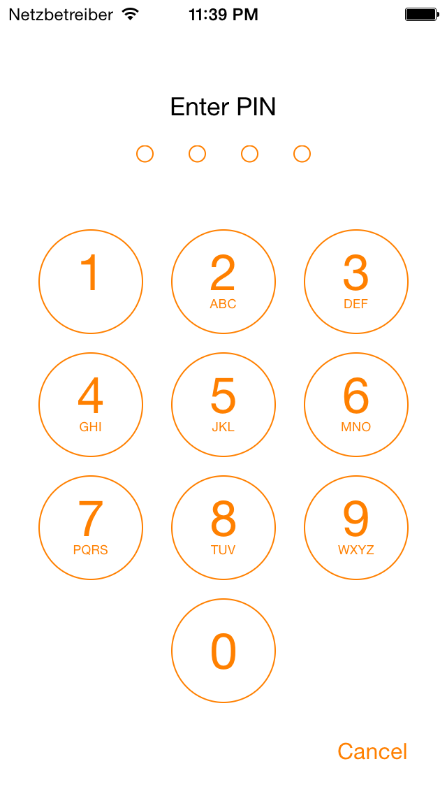
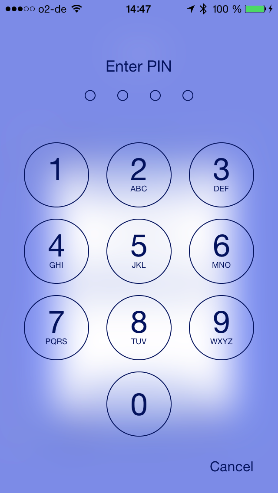
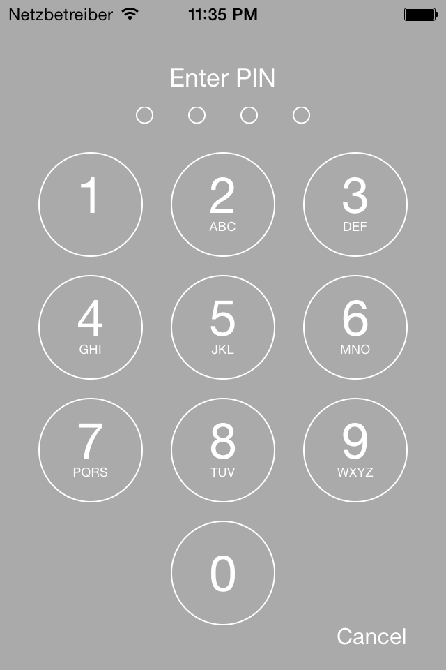
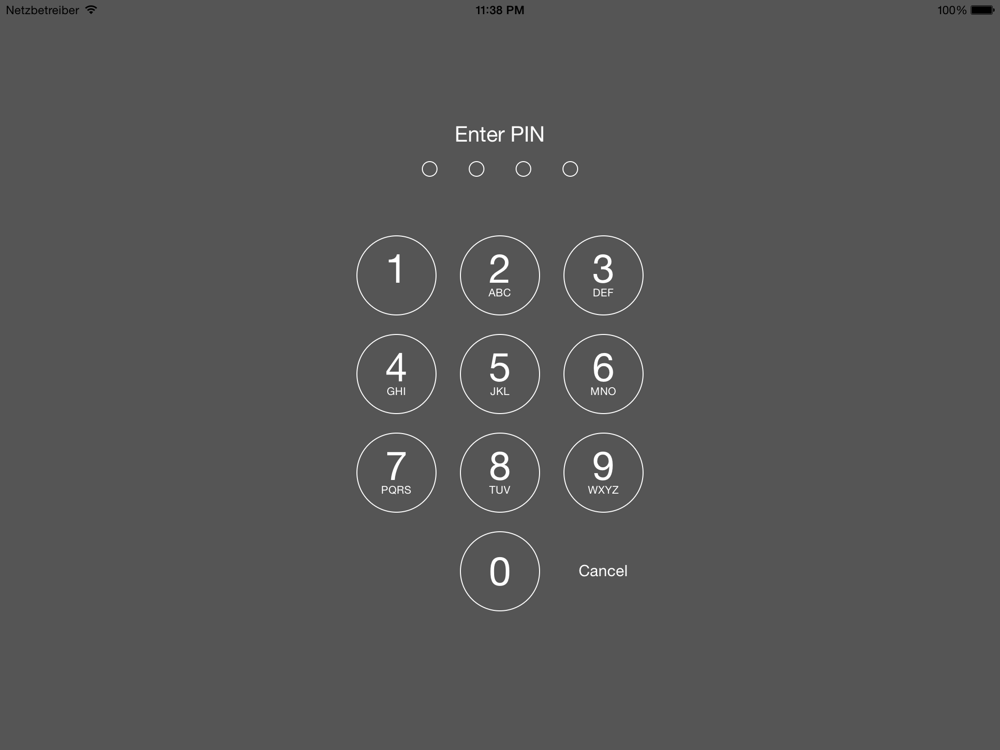

THPinViewController
===================

iOS 7 style PIN screen for iPhone and iPad that can be displayed modally whenever the user needs to authenticate, e.g. when accessing a specially protected part of your app.

Features
--------

* Has iPhone portrait and iPad portrait and landscape layouts
* Supports variable PIN lengths
* Buttons can show numbers and letters or only numbers
* Background and tint colors as well as text and color of the prompt can be customized
* Supports solid color and translucent/blurred background

Screenshots
-----------






Usage
-----

```obj-c
THPinViewController *pinViewController = [[THPinViewController alloc] initWithDelegate:self];
pinViewController.promptTitle = @"Enter PIN";
pinViewController.promptColor = [UIColor darkTextColor];
pinViewController.view.tintColor = [UIColor darkTextColor];
pinViewController.hideLetters = YES;

// for a solid color background, use this:
pinViewController.backgroundColor = [UIColor whiteColor];

// for a translucent background, use this:
self.view.tag = THPinViewControllerContentViewTag;
self.modalPresentationStyle = UIModalPresentationCurrentContext;
pinViewController.translucentBackground = YES;

[self presentViewController:pinViewController animated:YES completion:nil];

// mandatory delegate methods

- (NSUInteger)pinLengthForPinViewController:(THPinViewController *)pinViewController
{
    return 4;
}

- (BOOL)pinViewController:(THPinViewController *)pinViewController isPinValid:(NSString *)pin
{
    if ([pin isEqualToString:self.correctPin]) {
        return YES;
    } else {
        self.remainingPinEntries--;
        return NO;
    }
}

- (BOOL)userCanRetryInPinViewController:(THPinViewController *)pinViewController
{
    return (self.remainingPinEntries > 0);
}

// optional delegate methods

- (void)incorrectPinEnteredInPinViewController:(THPinViewController *)pinViewController {}
- (void)pinViewControllerWillDismissAfterPinEntryWasSuccessful:(THPinViewController *)pinViewController {}
- (void)pinViewControllerDidDismissAfterPinEntryWasSuccessful:(THPinViewController *)pinViewController {}
- (void)pinViewControllerWillDismissAfterPinEntryWasUnsuccessful:(THPinViewController *)pinViewController {}
- (void)pinViewControllerDidDismissAfterPinEntryWasUnsuccessful:(THPinViewController *)pinViewController {}
- (void)pinViewControllerWillDismissAfterPinEntryWasCancelled:(THPinViewController *)pinViewController {}
- (void)pinViewControllerDidDismissAfterPinEntryWasCancelled:(THPinViewController *)pinViewController {}
```

See the example project for more details.

Installation
-------

###As a Git Submodule

```
git submodule add git://github.com/antiraum/THPinViewController.git <local path>
git submodule update
```

###Via CocoaPods

Add this line to your Podfile:

```ruby
pod 'THPinViewController'
```
	
Compatibility
-------

THPinViewController requires iOS 7.0 and above. 

THPinViewController uses ARC. If you are using THPinViewController in your non-ARC project, you need to set the `-fobjc-arc` compiler flag for the THPinViewController source files.

License
-------

Made available under the MIT License.

Collaboration
-------------

If you have any feature requests or bugfixes feel free to help out and send a pull request, or create a new issue.
